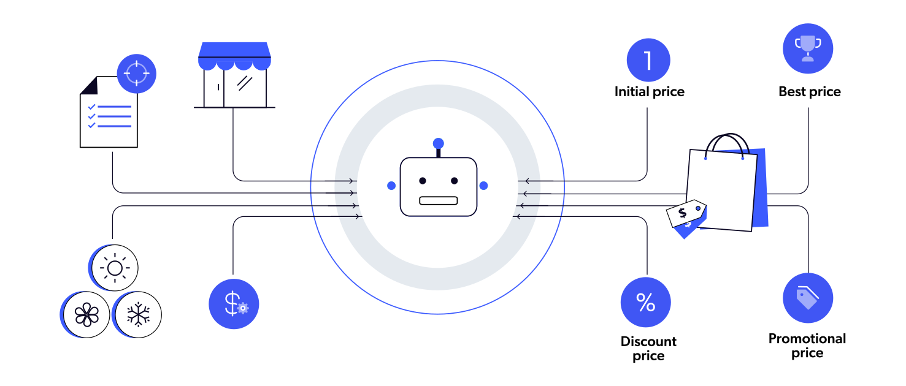

# How should we set the price of a product to get the maximum revenue from it?

Price optimization is essential for companies as it maximizes revenue and profit by ensuring products are neither underpriced nor overpriced. It provides **a competitive edge, positions products strategically, and allows dynamic responses to market changes**. 

Optimized pricing offers **insights into customer behavior, aids in market segmentation, and enhances inventory management** by balancing supply and demand.

It fosters long-term growth and brand loyalty through fair pricing and ensures financial health for investments in innovation.

## 🏨 Background

You are supporting a cafe with a project aimed to increase revenue from their items. They believe that they can use data science to help them!

They have asked you to **develop a pricing strategy to maximize their sales and revenues for their items**. They intend to use the results of your work to find their best pricing strategy.

## 💾 The Data

They have provided you with their transactions data in a file called `cafe_transaction_store.csv`, which contains the following:

| Column     | Description              |
|------------|--------------------------|
| `calendar_date` | Date of the transaction.|
| `holiday` | Whether the transaction date was on specific holiday. |
| `price` | Unit price of the item. |
| `quantity` | Sales quantity of the item. |
| `item_name` | The type of item was sold. |
